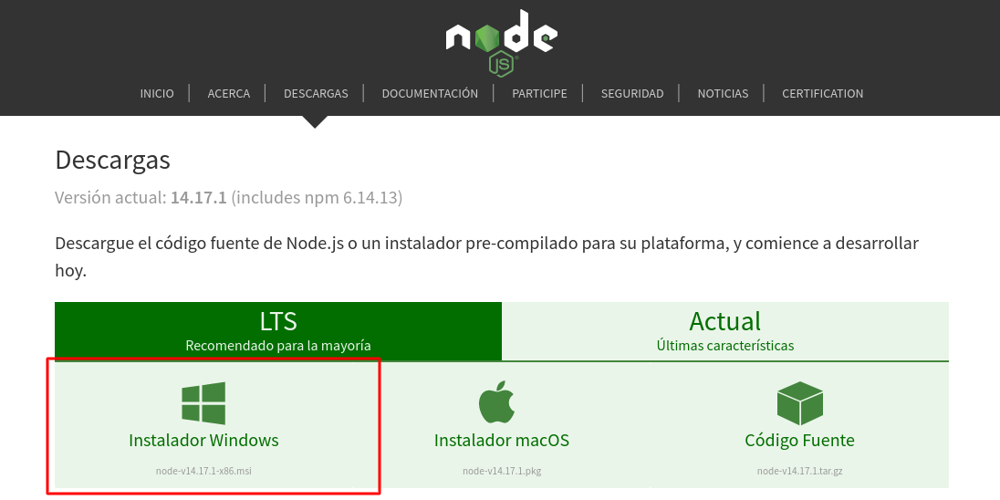

# Getting Started with ToDoApp

This project was bootstrapped with [Create React App](https://github.com/facebook/create-react-app).

## What you will need

You will have to get installed Node.js in latest LTS version if you don't have it

### To install Node.js in Windows

You will have to download the official installer from [nodejs.org](https://nodejs.org/es/download/).

Once you downloaded just have to install like any other program.

## How to start the program

Inside the project directory, you can run:

### `npm start`

Runs the app in the development mode.\
Open [http://localhost:3000](http://localhost:3000) to view it in the browser.

The page will reload if you make edits.\
You will also see any lint errors in the console.

You will no need to do nothing else after this command to run this project.

## Learn More

You can learn more about the tool used to build this project in the [Create React App documentation](https://facebook.github.io/create-react-app/docs/getting-started).

To learn React, check out the [React documentation](https://reactjs.org/).
